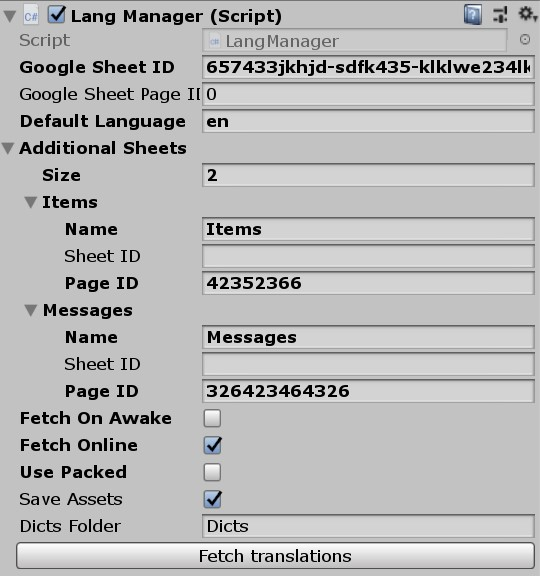
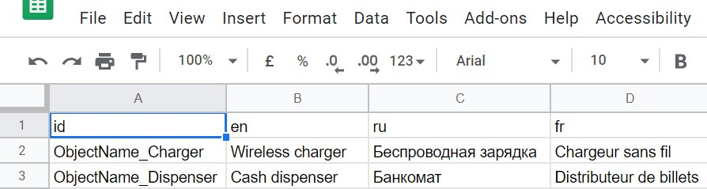

# Unity_Languages




Version 0.2

A translation system for Unity. Integrates Google Sheets or simple .csv   
Supports multisheet setups: different sheets for different types of translation items. In .csv form it transforms into multiple tables.   

```Fetch Online```: get dictionaries from Google Sheets   
```Dicts Folder```: if not from online, it will search .csv files in this folder (in Assets and Data folder if published)   
```Use Packed```: do not use exposed Data folder, but packed Resourse files

## Usage

```csharp
using FMLHT.Langs;

Label.text = L.Get("Button1_Name");
```

## ```lstring``` class

A string that holds an ID of the translatable item and a name of the Dictionary (or main one by default).   
Translates to current language on ```ToString()```   

```csharp
//Create new lstring with item and dictionary IDs
var name = L.S("Message_Win", "Messages");

//It will be translated using the current language
Debug.Log(name.ToString() + "!");

// You just won!
```
## ```lline``` class   
Array of lstrings and simple strings.   
Automatically translates all items and combines them.   

```csharp
//Imaginary data
int count = 10;
string username = "Frodo";

var message = L.LL()
    + L.S("Message_Win", "Messages")
    + " " + count
    + L.S("Money_Name", "Names")
    + ", " + username + "!";

Debug.Log(message.ToString());
// You just won 10 rings, Frodo!

//For example, let's switch a lang
L.SetLang("fr");

Debug.Log(message.ToString());
// Tu viens de gagner 10 bagues, Frodo!
```

## Adding to a project
1. Add LanguageManager prefab (also from the FMLHT menu)
2. Create a Google Sheet with rows like in the image
3. Get sheet id ang page id from the document address and fill in the component's fields
4. Tranlate!

    4.1. Add translatable component to any Text/TextMesh object

    4.2. Or call it internally with L.Get()